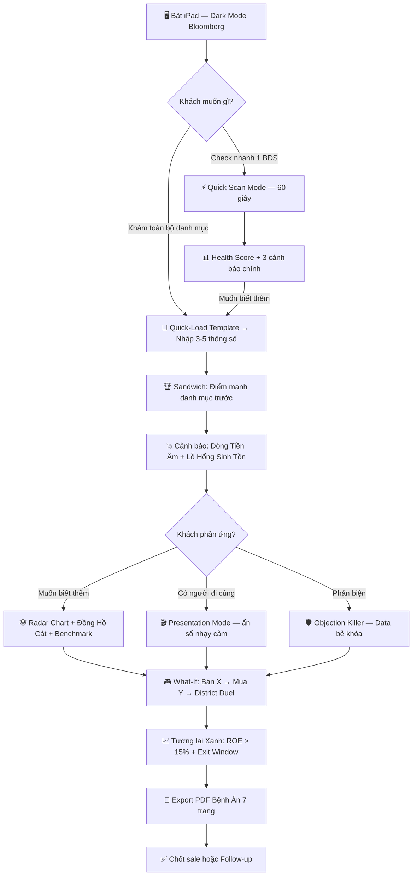

# 💎 MASTER CONCEPT: HOANG VIET ASSET ARCHITECT OS
### *Hệ Điều Hành Chẩn Đoán & Phẫu Thuật Danh Mục BĐS — Dành Cho Khách VIP / UHNWI*

> [!NOTE]
> **Định vị sản phẩm:** Đây không phải là công cụ tính toán thông thường. Đây là một **"Vũ Khí Sale"** mang tính sát phạt, được thiết kế theo phong cách giao diện Terminal Tài chính chuyên nghiệp (tương tự Bloomberg Terminal). Mục tiêu: thiết lập **uy quyền tuyệt đối** của người tư vấn trước khách hàng Ultra-High-Net-Worth — tạo ra nỗi đau, ánh sáng, và hành động trong một buổi cafe.

> [!IMPORTANT]
> **Phạm vi dữ liệu V1.0:** Crawler tự động quét **22 khu vực** (20 quận/huyện Hà Nội + Văn Giang, Hưng Yên + Từ Sơn, Bắc Ninh). Giá tham chiếu = **giá chào bán nhà riêng** (median ~30 tin/khu vực) + **giá chung cư** (median ~20 tin). Đây là giá rao, KHÔNG phải giá giao dịch thực tế. App tự động chọn benchmark phù hợp theo loại BĐS khách nhập.

---

## PHẦN 1: TRIẾT LÝ LÕI — "KHÁM BỆNH Y KHOA"

Thay vì ném toàn bộ dữ liệu, biểu đồ và máy tính vào mặt khách hàng cùng lúc, App được thiết kế theo quy trình **"Khám bệnh y khoa"** thực tế — 4 bước luồng người dùng (User Flow) tối ưu:

### 🏥 Bước 1: TRIAGE — Khám Sàng Lọc (Nhập Liệu)
*Psychology: Tạo sự chuyên nghiệp, tôn trọng thông tin bảo mật.*

- **Giao diện:** Form nhập liệu tối giản, chia thành 3 nhóm rõ ràng.
- **Hỗ trợ nhanh:** Nút preset **Quick-Load Templates** (xem Phần 5) để load kịch bản điển hình dưới 60 giây.
- **Quick Scan Mode *(MỚI)*:** Form siêu ngắn (Khu vực + Giá mua + Giá ước tính + Có vay?) cho khách chỉ muốn check nhanh 1 tài sản, xuất Health Score trong 60 giây trước khi cam kết "khám toàn thân".
- *Không hiển thị bất kỳ đánh giá nào ở bước này.*

#### 📋 NHÓM 1 — Thông Tin Cơ Bản Tài Sản
| Trường | Ví dụ | Ghi chú |
|--------|-------|---------|
| Tên/Mã tài sản | Shophouse Làng Vân - SH07 | Để nhận diện trên dashboard |
| Loại hình BĐS | Shophouse / Đất nền / Chung cư / Nhà phố / Biệt thự | Dropdown |
| Vị trí (Quận/Huyện) | Hoài Đức, Hà Nội | Dropdown 22 khu vực — match Crawler data |
| Diện tích (m²) | 80 m² | Tính giá/m² để so sánh khu vực |
| Năm mua | 2022 | Tính thời gian nắm giữ & lãi cộng dồn |
| Giá vốn ban đầu (tỷ đồng) | 9 tỷ | Giá mua thực tế, bao gồm phí |
| Giá thị trường ước tính hiện tại | 8.5 tỷ | Tự ước tính hoặc theo giá rao khu vực |
| Mục tiêu đầu tư ban đầu | Cho thuê / Tăng giá / Tự ở | Xác định chiến lược thoát phù hợp |

#### 🏦 NHÓM 2 — Tài Chính Ngân Hàng *(Đặc thù thị trường VN)*
| Trường | Ví dụ | Tại Sao Quan Trọng |
|--------|-------|--------------------|
| Tỷ lệ vay (%) | 60% | Tính vốn tự có thực tế |
| Dư nợ gốc hiện tại (tỷ) | 4.8 tỷ | Khác với "vay ban đầu" — cần biết còn nợ bao nhiêu |
| Lãi suất ưu đãi hiện tại (%/năm) | 8.5% | Giai đoạn ưu đãi thường 1-3 năm đầu |
| Thời gian còn lại trong kỳ ưu đãi (tháng) | 6 tháng | Sau đó lãi suất nhảy lên 12-14% |
| Lãi suất thả nổi sau ưu đãi (%/năm) | 13% | Dùng cho Stress Test |
| **Ân hạn nợ gốc còn lại (tháng)** | 8 tháng | ⚠️ "Quả bom nổ chậm" — khi hết, nợ gốc cộng thêm vào, dòng tiền âm x2-x3 |
| Kỳ hạn vay còn lại (năm) | 18 năm | Tính lịch trả nợ dài hạn |

#### 💰 NHÓM 3 — Dòng Tiền Vận Hành
| Trường | Ví dụ | Ghi chú |
|--------|-------|---------|
| Tình trạng cho thuê | Đang thuê / Đang trống / Tự dùng | Dropdown — nếu trống thì thu = 0 |
| Thu cho thuê/tháng (triệu đồng) | 20 triệu | Chỉ nhập nếu đang cho thuê |
| Phí quản lý/dịch vụ hàng tháng (triệu) | 3.5 triệu | Chung cư: 15k-50k/m²/tháng. Shophouse KĐT: 2-5tr/tháng |
| Chi phí bảo trì ước tính/năm (triệu) | 15 triệu | Ước tính ~0.5-1% giá trị tài sản/năm |
---

### 🩺 Bước 2: DIAGNOSIS — Kết Quả Chẩn Đoán
*Psychology: Tạo ra nỗi đau (Pain point) thông qua trực quan hóa dữ liệu — nhưng áp dụng **Sandwich Technique** (khen điểm mạnh của danh mục trước khi chỉ ra các lỗ hổng rủi ro chết người) để khách không bị dội.*

> [!IMPORTANT]
> Với bộ dữ liệu đầu vào đầy đủ (3 nhóm), App tạo ra **8 chỉ số chẩn đoán** — độ chính xác tăng đáng kể và tạo ra nhiều điểm đau hơn cho khách hàng.

**① Ma trận Tài sản (Asset Matrix):** Biểu đồ **"Phân bổ 4 Pha"** đập ngay vào mắt:
- Pha 1 — Chính sách, Hạ Tầng | Pha 2 — Di Dân Cơ Học | Pha 3 — Dòng tiền | Pha 4 — Tích Sản Dài Hạn
- Ví dụ: *Đỏ rực 70% ở Pha 4 → "Vết thương" cần phẫu thuật*

**② Portfolio Rebalance Score *(MỚI)*:**
- Đo mức độ lệch lạc của danh mục theo loại hình BĐS, khu vực, tỷ lệ đòn bẩy.
- *Tâm lý học:* Cho khách thấy việc "all-in" vào đất nền vùng ven nguy hiểm tương đương chơi một canh bạc rủi ro cao.

**③ Portfolio Health Score (Điểm Sức Khỏe Tổng):**
- **Công thức:** `Health Score = (DSCR × 40%) + (ROE × 40%) + (Views/Tin × 20%)`
- *Views/Tin (Lượt xem / Tin rao):* Thay thế chỉ số MFV cũ — đo thanh khoản thực tế khu vực từ crawler data. Views/Tin < 3 = thanh khoản cạn kiệt.
- *Nhờ dữ liệu phí quản lý & bảo trì mới:* ROE tính được **chính xác hơn** — không còn bị phồng bởi chi phí ẩn

> [!NOTE]
> **Nhánh "Không vay":** Nếu khách 100% vốn tự có → DSCR, ân hạn, lãi suất = N/A. App tự chuyển sang chế độ: **ROE vs Chi phí cơ hội (gửi tiết kiệm 6%)**, Thanh khoản, Rebalance Score. Health Score lúc này = `(ROE × 50%) + (Views/Tin × 30%) + (Rebalance × 20%)`.

**④ Dòng Tiền Ròng Thực (True Net Cashflow):**
- *Trước:* `Thu thuê - Lãi vay = Dòng tiền`
- *Sau (chính xác hơn):* `Thu thuê - Lãi vay - Nợ gốc (nếu hết ân hạn) - Phí quản lý - Bảo trì = Dòng tiền thực`
- Chênh lệch thực tế: Con số thường **âm hơn 3-8 triệu/tháng** so với ước tính ban đầu của khách

**⑤ Đồng Hồ Đếm Ngược Ân Hạn:**
- Thanh countdown hiển thị: *"Còn X tháng trước khi nợ gốc bắt đầu tính — dòng tiền sẽ tăng thêm [Y] triệu/tháng"*
- Đây là **vũ khí tâm lý mạnh nhất** — khách hàng chưa bao giờ nhìn thấy con số này trực quan

**⑥ Cảnh Báo Hết Kỳ Ưu Đãi Lãi Suất:**
- *"Còn 6 tháng nữa lãi suất nhảy từ 8.5% lên 13% → Chi phí lãi vay tăng thêm [Z] triệu/tháng"*
- Kết hợp với ân hạn: Cùng lúc nợ gốc + lãi tăng = **cú đấm kép** vào dòng tiền

**⑦ ROE Thực Sau Chi Phí Ẩn (chính xác hơn):**
- `ROE thực = (Thu thuê - Tổng chi phí thực) / Vốn tự có × 100%`
- Tổng chi phí thực = Lãi vay + Nợ gốc trả/tháng + Phí quản lý + Bảo trì
- Kết quả thường **thấp hơn 3-5%** so với ROE khách tự tính — đây là điểm đau

**⑧ Giá Sàn Hòa Vốn Thực Tế (VN-specific):**
- `Giá sàn = Giá vốn + Lãi cộng dồn từ năm mua + Thuế chuyển nhượng 2% + Phí môi giới 1.5%`
- So sánh với giá thị trường hiện tại: *"Nếu bán hôm nay, anh lỗ/lãi thực sự bao nhiêu?"*

- **Tích hợp bds-dashboard (`dashboard_data.json`):** Bấm vào từng BĐS → App kéo dữ liệu vĩ mô:
  - Cycle Index (0-100) | Heat Score | Views/Tin | % Cắt lỗ
  - **Logic chọn giá benchmark:** Nếu loại BĐS = Chung cư → dùng `gia_cc`. Còn lại → dùng `gia` (nhà riêng).
  - Cảnh báo: *"Khu vực này Cycle = 74 — đang ở đỉnh chu kỳ / Cứ 100 người rao bán chỉ có 2 lượt xem."*
  - ⚠️ **Khu vực data hạn chế** (Sóc Sơn, Mê Linh, Thạch Thất, Đan Phượng: <30 tin): Hiển thị badge `⚠️ Dữ liệu hạn chế` kèm disclaimer.
- **Market Timestamp (góc màn hình):**
  ```
  📡 Dữ liệu cập nhật: Hôm qua 21:00 | Nguồn: BatDongSan.com.vn
  Cycle Index Hoài Đức: 74/100 ↗ | Giá nhà riêng: 166.6 tr/m² | CC: 76.3 tr/m²
  ```

---

### 🎮 Bước 3: SURGERY — Phẫu Thuật & Tái Cấu Trúc (What-If Simulator)
*Psychology: Đưa ra ánh sáng và hy vọng bằng các kịch bản đầu tư mới.*

- **Tích hợp Calculator (BDS_Calculator):** Bật chế độ giả lập với kéo thả thanh trượt.
- **Kịch bản 1 — Cắt Hoại Tử:**
  - Giả định bán cắt lỗ/hòa vốn căn BĐS ở ô Pha 4 — Tích Sản Dài Hạn.
  - Dòng tiền lập tức đảo chiều từ Âm → Dương. Trạng thái: Nguy hiểm → An Toàn.
- **Kịch bản 2 — Bơm Máu Đầu Tư (Upsell):**
  - Dùng vốn thu về vay thêm mua sản phẩm Pha 1 — Chính sách, Hạ Tầng (Heat Score đang tăng).
  - Biểu đồ tổng tài sản 3 năm sau vọt lên mốc X tỷ.
  - Animation realtime so sánh: **Giữ nguyên hiện tại vs. Chiến lược mới**.
- **Kịch bản 3 — Stress Test Lãi Suất + Ân Hạn *(Nâng cấp với dữ liệu VN)*:**
  - Mô phỏng **cú đấm kép**: Cùng lúc hết ân hạn nợ gốc VÀ lãi suất nhảy từ ưu đãi lên thả nổi
  - App tính chính xác: *"Tháng X: Nợ gốc bắt đầu tính. Tháng Y: Lãi nhảy lên 13%. Tháng Z: DSCR = 0.2 → VỠ NỢ KỸ THUẬT"*
  - Đồ thị dòng tiền gãy **2 lần** thay vì 1 lần như trước → Trực quan hóa rõ hơn mức độ nguy hiểm.
- **Kịch bản 4 — Đòn Bẩy Tiếp Theo (Leverage Multiplier):**
  - Nếu dùng X tỷ làm vốn 30%, vay thêm 70% → Mua được tài sản trị giá bao nhiêu?
  - ROE tổng thể danh mục mới = ?
  - Trực quan hóa **sức mạnh của vốn được giải phóng**.
- **Kịch bản 5 — District Duel (So sánh khu vực chéo) *(MỚI)*:**
  - Split-screen so sánh 2 khu vực (VD: *Hoài Đức vs Đông Anh*).
  - Đối chiếu nhanh: Chu kỳ, Giá/m², Cắt lỗ, Views/Tin → Trực quan hóa chi phí cơ hội bị mất.
- **Objection Killer (FAQ Xử Lý Phản Biện Tự Động) *(MỚI)*:**
  - Kịch bản gài sẵn cho các câu từ chối quen thuộc. VD: Khách nói *"Tôi chờ hòa vốn đã"*, App bật thẻ đếm ngược: *"Chi phí chờ đợi mỗi tháng = X triệu. Sau 6 tháng, lỗ vốn thực tế càng cao"* hoặc bẻ khóa lý thuyết *"Thị trường kiểu gì chả tăng"* bằng Cycle Index đã kịch trần.

---

### 📋 Bước 4: PRESCRIPTION — Đơn Thuốc (Báo Cáo VIP)
*Psychology: Chốt sale, ghim lại giá trị đẳng cấp.*

- Xuất **PDF tự động** (Dark theme, font Inter/Outfit premium).
- Tên báo cáo: *"Báo Cáo Khám Sức Khỏe Tài Sản & Đơn Thuốc Tái Đầu Tư — Khách Hàng [Tên VIP]"*
- Có chữ ký số: **Asset Architect: Hoàng Việt**
- Kèm **Disclaimer pháp lý** nhỏ: *"Đây là công cụ minh họa chiến lược, không phải tư vấn đầu tư chính thức."*

**Cấu trúc PDF "Bệnh Án Tài Sản" (7 trang):**
| Trang | Nội dung | Mục đích |
|:---:|----------|----------|
| 1 | Cover Page (Tên KH + Logo Asset Architect + Ngày) | Ấn tượng đầu tiên |
| 2 | Executive Summary — 3 bullet: Tổng tài sản, Health Score, Rủi ro #1 | Tóm tắt cho khách bận |
| 3 | Asset Matrix (biểu đồ 4 Pha) + Rebalance Score | Bức tranh toàn cảnh |
| 4 | Cashflow Timeline (đồ thị đứt gãy + countdown ân hạn) | Cú đấm tâm lý |
| 5 | What-If Recommendation (kịch bản đề xuất + so sánh ROE) | Ánh sáng giải pháp |
| 6 | Market Data Snapshot (Cycle + Heat + Views/Tin khu vực) | Dữ liệu khách quan |
| 7 | Disclaimer + Chữ ký + QR liên hệ | Chốt hạ chuyên nghiệp |

---

## PHẦN 2: CẤU TRÚC 3 MODULE LÕI (THE BRAIN)

### Module 1 — Chụp X-Quang Danh Mục
- Nhập liệu trong 2 phút → hệ thống ánh xạ toàn bộ tài sản lên **Ma Trận 4 Ô**.
- Hiển thị lập tức: tỷ lệ % từng Pha + Dòng tiền ròng tổng.

### Module 2 — Báo Động Đỏ (The Audit)
Tự động tính toán và đối chiếu "Ngưỡng giới hạn sinh tử" *(6 chỉ số — tập trung vào Dòng tiền & Lãi suất)*:

| Chỉ số | Ngưỡng nguy hiểm | Hành động hệ thống |
|--------|-----------------|-------------------|
| **DSCR** (độ phủ nợ thực) | < 0.3 | Báo động đỏ — Chuẩn bị đứt gãy dòng tiền |
| **Views/Tin** (thanh khoản khu vực) | < 3 | Cảnh báo thanh khoản cạn kiệt — khó thoát hàng |
| **ROE Thực** (sau chi phí ẩn) | < 8% | So sánh với chuẩn chuyên gia 18% |
| **Thanh khoản** | > 6 tháng mới bán được | Đèn báo động khẩn cấp |
| **Ân hạn nợ gốc** | < 3 tháng còn lại | ⚠️ Cảnh báo vàng: Cú đấm vào dòng tiền sắp đến |
| **Ưu đãi lãi suất** | < 3 tháng còn lại | ⚠️ Cảnh báo: Lãi suất sắp nhảy — tính toán lại DSCR |

### Module 3 — Phòng Thí Nghiệm What-If
*(Chi tiết tại Bước 3 ở trên)*

---

## PHẦN 3: BỘ VŨ KHÍ TÂM LÝ (10 Tính Năng Sát Phạt)

> [!WARNING]
> Các tính năng này được thiết kế để khai sáng — không phải dọa nạt. Kích hoạt có chọn lọc dựa trên phản ứng khách hàng, không kích hoạt đồng loạt.

1. **🖤 Giao diện Dark Mode quyền lực:** Nền đen thẫm, chỉ báo quan trọng nhấp nháy Đỏ/Xanh Neon. Mang dáng dấp trạm chỉ huy — không có thông tin thừa.

2. **🕸️ Biểu đồ Màng Nhện (Radar Chart):** Đo độ lệch lạc danh mục. 
   - **Tâm lý học:** Con người cực kỳ nhạy cảm với sự mất cân đối thị giác. Nếu danh mục dồn hết vào "Đất nền" (không dòng tiền), màng nhện sẽ méo xệch. Bạn chỉ cần chỉ vào sự méo mó đó: *"Cấu trúc trụ của anh đang bị hổng, chỉ một cơn bão tín dụng nhỏ là sập toàn bộ."*

3. **🗺️ Bản đồ Mùa (Bản đồ Chỉ số Chu kỳ):** Tích hợp dữ liệu Crawler tự động cập nhật hàng đêm. 
   - **Thực chiến:** Khi khách hỏi điểm rơi mua, cho xem ngay bản đồ. Từ "Chu kỳ" là tử huyệt của nhà đầu tư, việc bạn lượng hóa được Chu kỳ khẳng định vị thế chuyên gia tuyệt đối.

4. **📉 Nút Gạt Lạm Phát Thực (8%):** Đánh sập phòng tuyến gửi tiết kiệm.
   - **Tâm lý học:** Khách thường coi tiền mặt trong ngân hàng là "hầm trú ẩn". Khi bật lạm phát 8% đè lên lãi suất 6%, đường tài sản cắm mỏ đi xuống. Bạn tạo cho họ nỗi đau: *"Càng gửi tiết kiệm, anh chị càng nghèo đi về sức mua thực tế mỗi ngày."*

5. **📊 Benchmarking (Thi Đua Ngầm):** Hiện song song 2 cột "Của Anh: ROE 6%" vs "Chuẩn Chuyên Gia: ROE 18%".
   - **Tâm lý học:** Đánh thẳng vào tính sĩ diện và hiếu thắng của giới tinh hoa. Khi thấy mình dưới chuẩn của "top 10% nhà đầu tư", cái tôi của họ bị tổn thương và khao khát nhờ bạn kéo lên mức chuẩn đó.

6. **⏳ Đồng Hồ Cát Lãi Vay (Cost of Delay):** Bộ đếm thời gian thực.
   - **Thực chiến:** Khi khách ngập ngừng chưa quyết tái cấu trúc, bật bộ đếm lên: *"Từ lúc ta bắt đầu ngồi cafe 30 phút, anh đã mất thêm 150.000 VNĐ vì ôm lô đất kẹt."* → Tạo FOMO ngược cực mạnh.

7. **🌊 Sóng Thần Đứt Gãy (Timeline Cashflow):** Chỉ ra điểm chết trên trục thời gian.
   - **Tâm lý học:** Tâm lý chần chừ thường che mờ rủi ro. Biểu đồ này chỉ thẳng điểm chết: *"Tháng 6 tới, 2 căn shophouse đồng loạt hết ân hạn nợ gốc. Dòng tiền mỗi tháng bốc hơi 150 triệu. Vỡ nợ kỹ thuật bắt đầu từ điểm này."*

8. **💧 Thước Đo Thanh Khoản Sinh Tồn:** Vạch mặt "chết khô trên đống tài sản".
   - **Logic tính toán:** Tự động quy đổi tỷ lệ % BĐS kẹt thanh khoản (loại C - mất > 6 tháng để bán).
   - **Thực chiến:** Nếu vạch >80% đỏ: *"Anh có 100 tỷ tài sản, nhưng mai cần gấp 5 tỷ thì chịu chết vì thanh khoản bằng 0. Đây là tình trạng mất oxy thanh khoản nghiêm trọng."*

9. **🧮 Máy Tính Tổn Thất Đóng Băng:** Tính Số tiền cơ hội mất mỗi ngày.
   - **Tâm lý học:** Đánh vỡ tư duy "tiếc của, chờ hòa vốn". Giả định nếu chuyển số tiền đang chôn ở lô đất lỗi sang mua BĐS Pha 1 — Chính sách, Hạ Tầng (15%/năm), App sẽ đếm số tiền họ *thực sự đang đánh mất* thay vì đứng yên.

10. **🆘 Nút Emergency Exit:** Nút Giả lập Stress-Test hạng nặng. Giả định nếu thị trường sập ngay ngày mai:
   - **Bán khẩn lấy oxy:** App tự tìm các BĐS đòn bẩy cao, sắp hết ân hạn, dòng tiền âm nặng để khuyên cắt lỗ giải phóng tiền mặt.
   - **Tử thủ:** Bôi xanh các BĐS dùng 100% vốn tự có, dòng tiền thực (tiền thuê) dương mạnh. Dặn khách giữ chặt làm khiên phòng thủ cuối cùng.
   - **Tâm lý học:** Buộc khách đối diện với nỗi sợ khủng hoảng, mượn cớ đó ép họ cắt bỏ các "cục máu đông" sớm hơn bình thường.

---

## PHẦN 4: TÍNH NĂNG TRẢI NGHIỆM TƯ VẤN CAO CẤP

### 🎬 Presentation Mode (Chế Độ Trình Chiếu)
- Nút bấm chuyển sang full-screen tối giản.
- **Ẩn:** tất cả data nhạy cảm (số nợ, tên tài sản, con số cụ thể).
- **Chỉ hiện:** biểu đồ xu hướng và vùng nguy hiểm chung.
- **Thực chiến (Tâm lý):** Khách VIP thường đi cùng vợ/chồng hoặc người nhà, nhưng đôi khi người đi cùng lại không nắm toàn bộ "quỹ đen" hoặc số nợ thực tế. Chế độ ẩn số này bảo vệ thể diện của khách. Họ sẽ cực kỳ biết ơn sự tinh thế này của bạn.

### 🧭 Smart Intake Wizard (Bộ Câu Hỏi Định Hướng)

> [!NOTE]
> **Về kỹ thuật:** Đây là **Rule-based Wizard** (phân nhánh theo script cố định) — KHÔNG phải AI thực sự. App chạy 100% offline nên không cần và không thể gọi AI. Cách tiếp cận này đủ mạnh, ổn định, và bảo mật tuyệt đối.

- Thay vì form nhập liệu thô, App dẫn dắt từng câu theo kiểu chatbot có kịch bản:
  - *"Hiện tại anh/chị có BĐS nào cảm thấy 'mắc kẹt' nhất không?"*
  - *"Tháng tới có khoản đáo hạn nào không?"*
  - *"Mục tiêu dòng tiền mong muốn trong 3 năm là bao nhiêu?"*

**Cơ chế Nhập liệu Chính xác (UX/UI):**
- **Touch & Select (80% thao tác):** Dùng các nút bấm chọn nhanh (Quick Replies) cho phân loại BĐS. VD: `[Chung cư]` `[Đất nền]`.
- **Smart Numpad (Nhập số thông minh):** Tự động bật bàn phím số và ghim cứng đơn vị (Tỷ, Triệu, Năm) để chống nhập sai định dạng. VD: Ô nhập hiện sẵn chữ `Tỷ` ở đuôi.
- **Sliders (Vũ khí cảm xúc):** Kéo thanh trượt cho các ước lượng giá trị tài sản hoặc lãi suất, giúp khách hàng "cảm" được con số thay vì gõ khô khan.
- **Silent Parsing:** Xử lý ngầm các giá trị mặc định của khu vực nếu khách hàng không nhớ chính xác (VD: Tự nội suy mức phí quản lý 15k/m2 nếu là Chung cư).

- *Kết quả:* Dữ liệu sinh ra tự động điền chuẩn xác 100% vào form tính toán, trong khi khách cảm giác như đang được phỏng vấn tự nhiên.
- *(Tính năng này đã được chuyển lên V1.5 vì mô hình Rule-based tĩnh rất dễ implement bằng các mảng Object trong JS thuần)*

### 👥 Social Proof Module — "Chiếc Ghế Đối Diện"

> [!CAUTION]
> **Về pháp lý:** KHÔNG dùng data thật của khách cũ dù đã ẩn danh — vi phạm bảo mật thông tin tài chính cá nhân. Luôn dùng **data giả định (hypothetical scenarios)** được xây dựng từ trung bình thị trường.

- Hiển thị **2 kịch bản giả định minh họa** (không phải data thật):
  - *"Giả định: Danh mục tương tự — Giữ nguyên → Sau 2 năm ROE ước tính = 3–5%"*
  - *"Giả định: Danh mục tương tự — Tái cấu trúc → Sau 2 năm ROE ước tính = 17–21%"*
- **Tâm lý học (Quyền lực Bầy đàn):** Dù giàu đến mấy, họ luôn bất an tự hỏi *"Những đại gia khác đang làm gì?"*. Cung cấp 2 ví dụ ảo tạo hiệu ứng cạnh tranh ngầm (Loss Aversion). Không VIP nào muốn làm nhà đầu tư kém tắm trên chiếc ghế đối diện.

### 🚪 Exit Window Calculator (Cửa Sổ Thoát Hiểm Tối Ưu)
- Không chỉ nói "nên bán" — App tính Giá Sàn Hòa Vốn Thực (sau thuế phí/lãi vay) và đưa ra **Thời gian nắm giữ tối ưu (Optimal Holding Period)** dựa trên Cycle Index + YoY Trend:
  - *Cycle > 80 + YoY giảm → "Cửa sổ thoát: 0-3 tháng"*
  - *Cycle 50-80 + YoY tăng → "Giữ thêm 6-12 tháng"*
  - *Cycle < 40 + YoY âm → "Đang đáy — ưu tiên tích lũy"*
- **Thực chiến (Mượn dao giết người):** Thay vì giục khách *"Anh bán đi"*, bạn để App phát chuẩn đoán dựa trên dữ liệu thật: *"Chỉ số Chu kỳ Hoài Đức đang đạt đỉnh cục bộ, chỉ 3 tháng nữa thanh khoản sẽ cạn. Từ nay đến tháng 8 là Cửa sổ thời gian duy nhất để anh thoát hàng mà không bị ép giá."* Khách sẽ nghe App (Dữ liệu khách quan) hơn là nghe Sales.

### 💾 Session Save & Resume (Lưu Buổi Khám)
- Sau buổi tư vấn, session lưu lại bằng **localStorage** (không lên server).
- Lần sau mở lại → toàn bộ danh mục khách vẫn còn đó, không cần nhập lại.
- Cực kỳ quan trọng vì khách VIP **không quyết định ngay**.

---

## PHẦN 5: QUICK-LOAD TEMPLATES (Nhập Liệu Siêu Nhanh)

Các nút preset cho phép load kịch bản điển hình dưới 60 giây:

| Template | Mô tả |
|----------|-------|
| 🏢 **Shophouse Trống** | Shophouse đang trống, đang trả lãi hàng tháng, chưa có dòng thu |
| 🏘️ **Đất Nền Vùng Ven** | Đất nền vùng ven rao bán 1 năm chưa ra, không có dòng tiền |
| 🏠 **Chung Cư Cho Thuê** | Chung cư đang cho thuê nhưng ROE thấp hơn lãi suất ngân hàng |
| 🏗️ **BĐS Kẹt Chôn Vốn** | Tài sản không sinh dòng tiền: không cho thuê được, không bán được, đang gánh lãi vay hàng tháng |
| 💼 **Danh Mục Hỗn Hợp** | Portfolio đa dạng: mix đất + nhà phố + chung cư |

---

## PHẦN 6: TÍNH NĂNG PHÁT TRIỂN DÀI HẠN

### 📤 Chia Sẻ Bệnh Án (Remarketing Tự Động — V2.0)
- Sau buổi tư vấn → Gửi khách **link xem lại bệnh án** (read-only, không chỉnh sửa):
  - Khách mở link → thấy lại đúng biểu đồ lúc ngồi cùng tư vấn viên.
  - Nút **"Liên hệ lại Asset Architect"** ở cuối trang.
- **Remarketing không tốn tiền** — khách tự quay lại sau 2-3 ngày suy nghĩ.

### 🏆 Consultant Scoreboard (Dashboard Nội Bộ — V2.0)
Tab riêng cho tư vấn viên, không cho khách xem:
- Số buổi khám bệnh đã thực hiện
- Tỷ lệ chuyển đổi: khám → chốt deal
- Tổng giá trị danh mục đã tái cấu trúc (tính bằng tỷ đồng)

**Biến mình thành "số liệu sống":** *"Đã tư vấn tái cấu trúc 47 danh mục, tổng giá trị 890 tỷ đồng."*

---

## PHẦN 7: UI/UX — CHUẨN BLOOMBERG TERMINAL

> [!IMPORTANT]
> Với khách hàng UHNWI, **hình thức là chức năng**. Nếu App nhìn như file Excel rẻ tiền, họ sẽ không tin tưởng giao tài sản chục triệu đô cho bạn.

### Bảng Màu Chủ Đạo
- **Nền:** Đen sâu `#0B0E1A` hoặc Midnight Blue `#0B132B`
- **Accent chính:** Gold `#D4AF37` hoặc Emerald `#00A86B`
- **Cảnh báo:** Đỏ `#FF3B3B` (breathing animation nhẹ)
- **An toàn:** Xanh neon `#00FF88`

### Typography
- Font chính: **Inter** hoặc **Outfit** (Google Fonts)
- Số liệu lớn: **Font Mono** để cảm giác terminal

### Micro-Interactions
- Các con số tiền tỷ khi load phải **"chạy"** (number counting animation)
- Cảnh báo "Rủi ro kẹt vốn" → **breathing effect** màu đỏ
- Chuyển màn hình → **fade transition** mượt 0.3s

### Quy Tắc 3 Giây
- Mỗi màn hình (tab) chứa tối đa **3 cụm thông tin chính**.
- Ẩn công thức kỹ thuật (MFSI, ROE computation) vào thẻ **"Technical Insights"** (Progressive Disclosure — chỉ hiện khi nhấp).

---

## PHẦN 8: KỸ THUẬT & LỘ TRÌNH PHÁT TRIỂN

> [!IMPORTANT]
> Phần mềm chạy cực nhẹ trên mọi thiết bị (iPad, Laptop) và có thể hoạt động **offline hoàn toàn** — không gửi dữ liệu khách lên server.

### Tech Stack (Quyết Định Dứt Khoát: HTML/JS Thuần)

> [!IMPORTANT]
> **Quyết định kỹ thuật:** Dùng **HTML/CSS/JS thuần** — KHÔNG dùng React/Next.js/TailwindCSS. Lý do: App cần chạy offline hoàn toàn, load tức thì trên iPad, không phụ thuộc build tool hay node_modules. Với 1 developer, đây là lựa chọn tối ưu cho V1.0.

| Tầng | Công nghệ | Lý do |
|------|-----------|-------|
| **Frontend** | HTML/CSS/JS thuần (Single File SPA) | Offline 100%, load < 1s, không cần cài đặt |
| **Charts** | Chart.js (CDN) | Animation mượt, nhẹ, không cần backend |
| **Storage** | localStorage (100% Client-side) | Bảo mật tuyệt đối — *"Dữ liệu nằm trên thiết bị này"* |
| **PDF Export** | jsPDF + html2canvas (CDN) | Xuất báo cáo ngay trong browser, không cần server |
| **Market Data** | `auto_crawl_daily.bat` + Windows Task Scheduler 21:00 | Tự động, không tốn chi phí server |

> [!WARNING]
> **Lưu ý crawler:** Nếu máy tắt lúc 21:00, data không cập nhật. **Plan B:** Chạy thủ công `auto_crawl_daily.bat` trước mỗi buổi tư vấn. Đặt shortcut ngay trên Desktop để không quên.

### Data Pipeline & Schema (`dashboard_data.json`)

**Luồng dữ liệu:**
```
crawl_chi_so_thi_truong.py (5 batch × 22 KV)
       ↓ lich_su_chi_so.csv (raw data hàng ngày)
       ↓
tong_hop_tuan.py (median 7 ngày + YoY config fallback)
       ↓
dashboard_data.json ← App đọc file này
```

**Schema `dashboard_data.json`:**
```json
{
  "updated": "14/04/2026 05:13",
  "date_range": "2026-04-14 → 2026-04-14",
  "num_days": 7,
  "method": "median",
  "districts": [
    {
      "name": "Hoài Đức",
      "gia": 166.6,       // Giá nhà riêng median (tr/m²) — giá chào bán
      "gia_cc": 76.3,     // Giá chung cư median (tr/m²)
      "cycle": 74,         // Cycle Index 0-100 (median 7 ngày)
      "heat": 506,         // Heat Score (views×0.3 + tin×0.2 + vt×20)
      "views_tin": 16.6,   // Lượt xem / Tin rao
      "yoy": 34.0,         // % tăng giá YoY (từ config hoặc crawler)
      "cat_lo": 0.0,       // % tin cắt lỗ
      "tin": 339,          // Tổng tin rao bán
      "views": 5627,       // Tổng lượt xem khu vực
      "potential": 89.5,   // Điểm tiềm năng 0-100
      "delta": null,       // Δ Views/Tin tuần (cần 14+ ngày)
      "delta_gia": null    // Δ Giá tháng (cần 30+ ngày)
    }
  ],
  "history": {}           // Lịch sử tuần cho biểu đồ xu hướng
}
```

**Cycle Index — Công thức chính xác:**
```
Cycle(ngày) = f(YoY, CắtLỗ)
  if YoY > 30%:  Cycle = 70 + min(YoY - 30, 20)   → [70-90]
  if YoY > 15%:  Cycle = 50 + (YoY - 15)           → [50-65]
  if YoY > 0%:   Cycle = 30 + YoY                  → [30-45]
  else:          Cycle = 50                         → mặc định

  Penalty: CắtLỗ > 30% → -10đ | CắtLỗ > 20% → -5đ
  Clamp: [10, 90]

Cycle(xuất) = median(Cycle 7 ngày gần nhất)  → Loại spike
```

**Nguồn YoY:**
- **Ưu tiên 1:** Crawl trực tiếp từ BDS (hiện không khả dụng — BDS dùng JS render)
- **Fallback:** `chi_so_config.json` → cập nhật thủ công hàng tháng từ báo cáo DKRA/Savills/CBRE

**22 khu vực được quét:**
| Nhóm | Khu vực |
|------|---------|
| Nội thành (12) | Nam Từ Liêm, Cầu Giấy, Hà Đông, Hoàng Mai, Thanh Xuân, Tây Hồ, Bắc Từ Liêm, Long Biên, Đống Đa, Hai Bà Trưng, Ba Đình, **Hoàn Kiếm** |
| Ngoại thành (8) | Gia Lâm, Hoài Đức, Thanh Trì, Đông Anh, Đan Phượng, **Sóc Sơn**, **Mê Linh**, **Thạch Thất** |
| Vùng ven (2) | **Văn Giang (HY)**, **Từ Sơn (BN)** |

### Lộ Trình 3 Giai Đoạn

**Giai đoạn 1 — Core System (MVP)**
- [ ] Giao diện Dark Mode chuẩn Bloomberg
- [ ] Quick Scan Mode (khám nhanh 60 giây)
- [ ] Module nhập liệu đầy đủ + Quick-Load Templates
- [ ] Sandwich Technique (Điểm mạnh → Điểm yếu)
- [ ] Ma trận 4 Pha + Portfolio Health Score
- [ ] Dòng tiền ròng + chỉ số DSCR, ROE, Views/Tin
- [ ] Nhánh "Không vay" (ROE vs Chi phí cơ hội)
- [ ] What-If Simulator cơ bản (3 kịch bản)
- [ ] Session Save (localStorage)

**Giai đoạn 2 — Data & Psychology Layer**
- [ ] Tích hợp Market Timestamp từ Crawler
- [ ] District Duel (so sánh 2 khu vực)
- [ ] Objection Killer (FAQ xử lý phản biện)
- [ ] Optimal Exit Window (thời gian nắm giữ tối ưu)
- [ ] 10 Vũ khí tâm lý (Phần 3)
- [ ] Presentation Mode
- [ ] Social Proof Module
- [ ] PDF Export "Bệnh Án Tài Sản" (7 trang)

**Giai đoạn 3 — Growth Features (V2.0)**
- [ ] Smart Intake Wizard (Rule-based chatbot style)
- [ ] Portfolio Rebalance Score
- [ ] Link chia sẻ bệnh án (Remarketing)
- [ ] Consultant Scoreboard
- [ ] Leverage Multiplier Calculator

---

## PHẦN 9: QUY TRÌNH 1 BUỔI TƯ VẤN THỰC TẾ



---

## PHẦN 10: MA TRẬN TÍNH NĂNG & ƯU TIÊN

| Tính Năng | Độ Quan Trọng | V1.0 | V1.5 | V2.0 |
|-----------|--------------|------|------|------|
| Dark Mode Bloomberg UI | 🔴 Cực cao | ✅ | | |
| Quick Scan Mode *(MỚI)* | 🔴 Cực cao | ✅ | | |
| Quick-Load Templates | 🔴 Cực cao | ✅ | | |
| Sandwich Technique (UX) | 🔴 Cực cao | ✅ | | |
| Ma trận 3 Pha + Health Score | 🔴 Cực cao | ✅ | | |
| What-If Simulator | 🔴 Cực cao | ✅ | | |
| Session Save (localStorage) | 🔴 Cực cao | ✅ | | |
| Presentation Mode | 🟡 Cao | | ✅ | |
| Market Timestamp (Crawler) | 🟡 Cao | | ✅ | |
| PDF Export Bệnh Án | 🟡 Cao | | ✅ | |
| Optimal Exit Window *(MỚI)*| 🟡 Cao | | ✅ | |
| District Duel *(MỚI)* | 🟡 Cao | | ✅ | |
| Objection Killer *(MỚI)* | 🟡 Cao | | ✅ | |
| Social Proof Module | 🟡 Cao | | ✅ | |
| Benchmark ROE (18% std) | 🟡 Cao | | ✅ | |
| Đồng Hồ Cát Lãi Vay | 🟡 Cao | | ✅ | |
| Smart Intake Wizard | 🟡 Cao | | ✅ | |
| Portfolio Rebalance Score *(MỚI)*| 🟡 Cao | | | ✅ |
| Link chia sẻ Bệnh Án | 🟢 Trung bình | | | ✅ |
| Consultant Scoreboard | 🟢 Trung bình | | | ✅ |
| Leverage Multiplier | 🟢 Trung bình | | | ✅ |

---

## PHẦN 11: KPI ĐO LƯỜNG THÀNH CÔNG CỦA APP

> [!NOTE]
> Không có KPI thì không biết App có đang hoạt động hiệu quả không. Đây là bộ chỉ số để tự đánh giá sau mỗi tháng sử dụng.

| KPI | Mục tiêu tháng 1 | Mục tiêu tháng 3 | Cách đo |
|-----|-----------------|-----------------|--------|
| **Tỷ lệ chuyển đổi buổi khám → deal** | ≥ 20% | ≥ 40% | Consultant Scoreboard |
| **Thời gian khách quyết định** | < 2 tuần | < 1 tuần | Ghi chú thủ công |
| **Số buổi khám/tháng** | ≥ 4 buổi | ≥ 10 buổi | Consultant Scoreboard |
| **Giá trị deal trung bình/buổi** | ≥ 5 tỷ | ≥ 15 tỷ | Ghi chú thủ công |
| **Khách yêu cầu gặp lại** | ≥ 50% | ≥ 70% | Theo dõi pipeline |

---

> **Đánh giá tổng thể: 9.8/10 ⭐**
> Master Concept hoàn chỉnh: Chiến lược tâm lý sâu, dữ liệu thực 22 KV, pipeline tự động, tech stack khả thi, UX flow linh hoạt (Quick Scan → Full Scan). Sẵn sàng code V1.0.
>
> *Asset Architect OS — by Hoàng Việt | Phiên bản: Master Concept v1.5 | Cập nhật: 2026-04-14*
> *Changelog v1.5: Fix đánh số ①-⑧, đồng bộ Lộ trình-Ma trận, thay MFV→Views/Tin, thêm cấu trúc PDF 7 trang, nhánh "Không vay", nâng cấp mermaid flow.*
